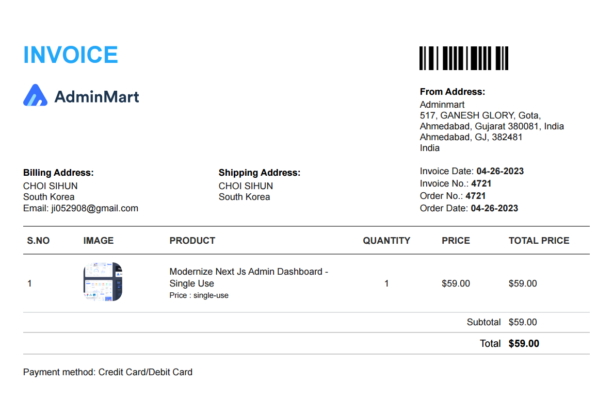
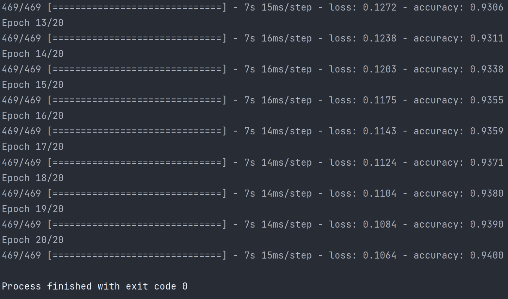
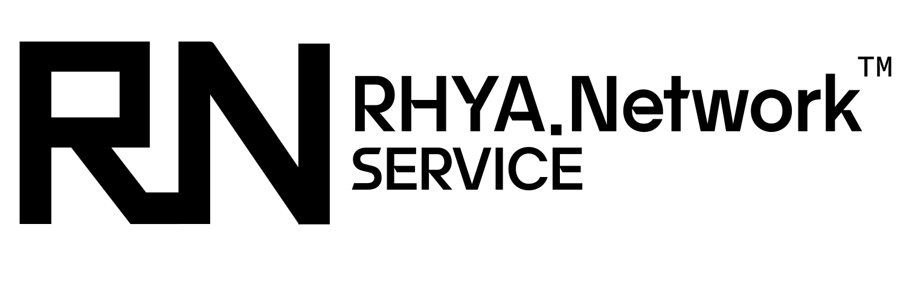

# RHYANetwork_WebtoonBoard
RHYA.Network WebtoonBoard Project


## 개발 현황
https://docs.google.com/spreadsheets/d/1-KMWENciZqUc4pnORCpT-AEBdD_EhtQcHqLmGnskyCM/edit?usp=sharing

## Repo 정보
해당 Repo는 Public 전용 Repo 이기 때문에 .env 파일 이나 기타 인증 정보 파일은 제거 하였습니다. 
### Backend ENV ('.env.dev', '.env.prod')
```env
# Database connection info
DATABASE_HOST=""
DATABASE_PORT=
DATABASE_USERNAME=""
DATABASE_PASSWORD=""
DATABASE_NAME=""

# Root email account info
ROOT_EMAIL_SMTP_SERVER_HOST=""
ROOT_EMAIL_SMTP_SERVER_PORT=
ROOT_EMAIL_ACCOUNT_ID=""
ROOT_EMAIL_ACCOUNT_PASSWORD=""

# Elasticsearch server info
ELASTICSEARCH_SERVER_URL=""
ELASTICSEARCH_SERVER_USERNAME=""
ELASTICSEARCH_SERVER_PASSWORD=""

# Axios HTTP setting info
HTTP_TIMEOUT=
HTTP_MAX_REDIRECTS=

# Backend api access key
#
#
# This key is required when accessing Backend from Frontend.
#
# Restrict client access through this key.
# ** WARNING: The key must have the same key for both Backend and Frontend.
# ** For the above reasons, the key should never be released to the outside world. **      
BACKEND_API_ACCESS_KEY=""

# Login cookie aes secret key
#
# 
# This key is the encryption key for the integrity of the login in Frontend.
# 
# Restrict client access through this key.
# ** WARNING: The key must have the same key for both Backend and Frontend.
# ** For the above reasons, the key should never be released to the outside world. **          
LOGIN_COOKIE_AES_SECRET_KEY=""

# Backe end cookie aes secret key
#
#
# This is the key that Backend uses to encrypt cookie data.
#
# ** WARNING: The key should never be released to the outside world.
DEFAULT_COOKIE_AES_SECRET_KEY=""

# Server stop key
SERVER_STOP_KEY=""

# No api key authorization header allow path
# All lowercase letters are required
ALLOWED_NO_AUTHORIZATION_HEADER_CHECK_URL=""
ALLOWED_NO_AUTHORIZATION_HEADER_URLS=""
```

### Forentend ENV ('.env')
```env
# Webtoon board backend api host setter
# "local" : 개발 서버
# "public" : 실 서버
NEXT_PUBLIC_WBF_USE_BACK_ADDRESS=""
# Webtoon board backend api host [DEV]
NEXT_PUBLIC_WEBTOON_BOARD_BACKEND_API_HOST=""
# Webtoon board backend api host [PRODUCTION]
NEXT_PUBLIC_WEBTOON_BOARD_BACKEND_API_HOST_PRODUCTION=""

# Backend api access key
#
#
# This key is required when accessing Backend from Frontend.
#
# Restrict client access through this key.
# ** WARNING: The key must have the same key for both Backend and Frontend.
# ** For the above reasons, the key should never be released to the outside world. **      
BACKEND_API_ACCESS_KEY=""

# Login cookie aes secret key
#
# 
# This key is the encryption key for the integrity of the login in Frontend.
# 
# Restrict client access through this key.
# ** WARNING: The key must have the same key for both Backend and Frontend.
# ** For the above reasons, the key should never be released to the outside world. **          
LOGIN_COOKIE_AES_SECRET_KEY=""

# Server stop key
SERVER_STOP_KEY=""
```

### Management server ENV ('webtoon-board-management-server/wbm_src/util/auth/auth_info.py')
```python
from typing import Final

# Github token
GITHUB_TOKEN: Final = ""

# Database connection info
DATABASE_HOST: Final = ""
DATABASE_PORT: Final = 
DATABASE_ID: Final = ""
DATABASE_PASSWORD: Final = ""
DATABASE_NAME: Final = ""

# BACKEND SERVER Stop key
SERVER_STOP_KEY: Final = ""
```

### Comment analyzer ENV ('config.yaml')
```yaml
webtoon_board_comment_analyzer:
    #
    # Elasticsearch 서버의 사용자 인증 정보
    #
    elasticsearch_credentials:
        scheme:
        host:
        port:
        username:
        password:

    #
    # MariaDB 서버의 사용자 인증 정보
    #
    mariadb_credentials:
        host:
        port:
        database:
        username:
        password:

    #
    # Github API 서버의 사용자 인증 키
    #
    github_credentials:
        token:

    #
    # Backend API 서버의 인증 키
    #
    backend_api_server_credentials:
        url:
        access_key:

    #
    # 한국어 감정 분석 keras 모델 폴더 경로
    #
    ksa_keras_model:
        target:


    #
    # 종료 메시지 리스트
    #
    exit_message:
        - 'Bye.'
        - 'See you again.'
        - 'Goodbye.'
        - 'Have a nice day.'
        - 'See you later.'
        - 'See you soon.'
        - 'See you tomorrow.'
        - 'See you next time.'
        - 'See you in a bit.'
        - 'See you in a while.'
        - 'See you in a moment.'
        - 'See you in a few minutes.'
```

## Wbebtoon Board BackendAPI Server

### 개발 규칙
* 디자인 패턴은 MVC 패턴을 준수 한다.
* 네이밍 규칙은 다음을 따른다.
  - 패키지: 모두 소문자로 하되, 단어별로 띄어 쓸 경우엔 띄어쓰기를 `-`으로 대체한다.
  - 파일: 모두 소문자로 하되, 단어별로 띄어 쓸 경우엔 띄어쓰기를 `-`으로 대체한다.
    + _단, 이름이 끝난 뒤에 바로 확장자가 부여되지 않고 해당 파일의 역할 부여 후 확장자를 붙인다_
  - 클레스, 메소드, 인터페이스: `파스칼 표기법`을 따른다.
  - 변수 및 기타 등: `카멜 표기법`울 따른다.
  - 접두사는 `webtoon`만 허용한다.
* service에 포함된 함수는 예외가 절대 발생해서는 안 된다. (일부 함수 제외)
  - 따라서 `try catch` 구문을 사용한다.
* service에 포함된 함수는 반환 데이터가 `Optional<T>`여야 한다. (일부 함수 제외)
* Logger를 사용할 경우 미리 정의되어있는 Custom Logger인 `MyLogger`를 사용해야 한다.
  - _Logger 사용 시 `private readonly LOGGER_CONTEXT_NAME: string`를 선언하여 로깅 메소드 호출 시 사용하여야 한다_
  - _Exception(예외) 로그일 경우는 출력형식을 `getErrorMessage()`함수에서 받아와서 출력한다_
* 컨트롤러에서 파라미터를 입력받을 때 `@Query` 데코레이터를 사용하여 받는다.
* 컨트롤러에서 JSON 데이터를 입력받을 때 `@Body` 데코레이터를 사용하여 받는다.
* 모든 입력과 인자는 `DTO`를 사용한다.
* 의존성 주입에 사용하는 변수는 무조건 `readonly`를 사용해야 한다.

### 패키지 정보
* src
  - naver-webtoon --> 네이버 웹툰 API
  - webtoon-info --> 웹툰 정보 관리
  - user --> 사용자 계정 관리
  - util
    + crypto --> 암호화 관련 
    + email --> 이메일 발송 및 인증
    + dto --> 전역 DTO
    + exception --> 전역 Exception 관리
    + logger --> Custom logger
    + middlewares --> 미들웨어 파일

### 보안 수준 유지 규칙 사항
* 1번: ```.env``` 파일의 경우 절대 외부로 유출되어서는 안 됨
* 2번: ```.env``` 파일 내부에 ```ALLOWED_NO_AUTHORIZATION_HEADER_URLS```에 ```,```문자로 Split 되어 있는 페이지 이외에는 접근 시 ```BACKEND_API_ACCESS_KEY```에 명시되어 있는 키값을 ```authorization``` 헤더에 포함해야 함

### 서버 중지 방법
* ```http://<host>:<port>/``` or ```https://<host>:<port>/``` 에 ```authorization``` 헤더에 서버 종료 키를 전송
  * _서브 URL은 상관없음_
* 서버 종료 키는 ```.env```파일에 ```SERVER_STOP_KEY```에 명시되어 있음

## Wbebtoon Board Frontend Server
_사전에 정의된 규칙 및 패키지 정보 없음 (단, 일부 패키지 및 규칙 정보만 표기함)_

### NextJS 템플릿 Modernize Next Js Admin Dashboard
* Modernize Next Js Admin Dashboard Pro Version
* Single Use Licenses 

템플릿: https://adminmart.com/product/modernize-next-js-admin-dashboard/?ref=5 

_License 구매 영수증_


### 패키지 정보
* src
  + backend-api --> Backend API 접근 전용 클라이언트 및 Util Script
    + auth --> 사용자 로그인 및 인증 관련 Script
    + client --> Backend API 접근 전용 클라이언트

### 보안 수준 유지 규칙 사항
* 1번: ```.env``` 파일의 경우 절대 외부로 유출되어서는 안 됨
* 2번: BackendAPI 접근 시 ```BackendAPI 보안 수준 유지 규칙 사항``` 2번에 명시된 ```ALLOWED_NO_AUTHORIZATION_HEADER_URLS``` 에 명시된 페이지 이외, 즉 ```authorization``` 헤더가 필요한 페이지 접근 시 반드시 ```getServerSideProps()``` 에서 작업을 처리할 것 (Frontend에 작업이 넘어가면 안 됨)
* 3번: 단, ```login-user-task``` 컨트롤러의 접근은 로그인 성공 시 API키가 없어도 허용

### 서버 중지 방법
* ```http://<host>:<port>/stop``` or ```https://<host>:<port>/stop``` 에 ```authorization``` 헤더에 서버 종료 키를 전송
  * _서브 URL 상관있음_
* 서버 종료 키는 ```.env```파일에 ```SERVER_STOP_KEY```에 명시되어 있음

## Webtoon Board Management Server
_PYTHON VERSION: python39_ 

* 이 프로젝트의 IDE는 ```Pycharm 2023.3.1```를 사용함
* 패키지 관리자: Aanaconda (conda 23.3.1)
* 가상환경 이름: webtoon-board-management-server
* 의존성 패키지 설치 방법
  * environment.yml 내용에 prefix의 경로를 설치하려는 컴퓨터 경로에 맞추어 수정 한다.
  * ```conda env create --file environment.yml``` 명령어로 가상환경을 설치한다.

### 인증 정보 및 메타 데이터 저장 파일 리스트
* wbm_src.util.auth.auth_info
  * Github token
  * 데이터베이스 접근 계정 및 호스트 정보
  * Frontend/Backend 서버 중지 키
* wbm_src.util.auth.project_path
  * Frontend 서버 파일 저장 경로
  * Backend 서버 파일 저장 경로
  * 관리 서버 리소스 저장 경로
* wbm_src.util.auth.wb_server_info
  * (내부 접속 전용) Frontend 서버 주소
  * (내부 접속 전용) Backend 서버 주소

### 관리 서버 사용방법
* Flask 기반의 웹 서버 (HOST: https://webtoon-board-admin.rhya-network.kro.kr/)
* 모든 HTTP 요청은 ```authorization``` 헤더에 ```service_config``` 테이블에 ```management_server_api_key``` 값을 포함하여 같이 요청을 전송해야 한다.
* 관리 서브 URL 리스트
  * ```<HOST>/git_pull_request``` ```[GET] 요청``` : Github ```RHYANetwork_WebtoonBoard``` 레포트리지의 master 브렌치를 내려받아 자동 패치를 진행한다.
  * ```<HOST>/all_start``` ```[GET] 요청``` : ```Frontend, Backend``` 서버 실행
  * ```<HOST>/all_stop``` ```[GET] 요청``` : ```Frontend, Backend``` 서버 중지
  * ```<HOST>/front_start``` ```[GET] 요청``` : ```Frontend``` 서버 시작
  * ```<HOST>/back_start``` ```[GET] 요청``` : ```Backend``` 서버 시작
  * ```<HOST>/front_stop``` ```[GET] 요청``` : ```Frontend``` 서버 중지
  * ```<HOST>/back_stop``` ```[GET] 요청``` : ```Backend``` 서버 중지

## Webtoon Board Comment Analyzer
웹툰 보드 관리자 전용 웹툰 댓글 분석기

_PYTHON VERSION: python39_ 
* Windows only
* JAVA(JDK) 1.8.0 or higer Requires
* Tensorflow-GPU: v2.9.0
* NVIDIA CUDA: v11.2
* NVIDIA cuDDN: v8.1.0 (January 26th, 2021)
  * Add environment variable 'CUDA\v11.2\bin' (PATH)
  * Add environment variable 'CUDA\v11.2\include' (PATH)
  * Add environment variable 'CUDA\v11.2\lib\x64' (PATH)

* 이 프로젝트의 IDE는 ```Pycharm 2023.3.1```를 사용함
* 패키지 관리자: Aanaconda (conda 23.3.1)
* 가상환경 이름: webtoon-board-comment-analyzer
* 의존성 패키지 설치 방법
  * ```dependency/environment.yml``` 내용에 prefix의 경로를 설치하려는 컴퓨터 경로에 맞추어 수정 한다.
  * ```conda env create --file environment.yml``` 명령어로 가상환경을 설치한다.
  * 또는 ```dependency/dev-anaconda-install.bat``` 파일을 실행하여 가상환경을 설치한다.
  * _(주의! Git push 작업 시 패키지 의존성 문제 해결을 위해 ```dependency/dev-anaconda-package.bat``` 파일을 실행하고 push 작업을 진행해야 한다.)_

### 인공지능 모델 설명
* model 폴더
  * 미리 학습시킨 모델이 분할 압축으로 압축되어 있다. 해당 압축을 풀고 개발환경에 맞추어 ```rhya_model``` 폴더의 위치를 변경한다.
* data 폴더
  * 인공지능을 학습한 데이터가 분할 압축으로 압축되어 있다. 

_**테스트:** 이 인공지능을 테스트하려면 인공지능 모델을 ```test``` 폴더 내부로 위치 시키고 ```test.model.py``` 를 실행한다._ 

_**학습:** 이 인공지능을 다시 학습시키고 싶은 경우 인공지능 학습 데이터를 ```train``` 폴더 내부로 위치 시키고 ```train.py``` 를 실행한다._ 

**인공지능 모델 정확도: 94.00000%** 



## Licenses
BSD 2-Clause License

Copyright (c) 2023, CHOI SI-HUN

Redistribution and use in source and binary forms, with or without
modification, are permitted provided that the following conditions are met:

1. Redistributions of source code must retain the above copyright notice, this
   list of conditions and the following disclaimer.

2. Redistributions in binary form must reproduce the above copyright notice,
   this list of conditions and the following disclaimer in the documentation
   and/or other materials provided with the distribution.

THIS SOFTWARE IS PROVIDED BY THE COPYRIGHT HOLDERS AND CONTRIBUTORS "AS IS"
AND ANY EXPRESS OR IMPLIED WARRANTIES, INCLUDING, BUT NOT LIMITED TO, THE
IMPLIED WARRANTIES OF MERCHANTABILITY AND FITNESS FOR A PARTICULAR PURPOSE ARE
DISCLAIMED. IN NO EVENT SHALL THE COPYRIGHT HOLDER OR CONTRIBUTORS BE LIABLE
FOR ANY DIRECT, INDIRECT, INCIDENTAL, SPECIAL, EXEMPLARY, OR CONSEQUENTIAL
DAMAGES (INCLUDING, BUT NOT LIMITED TO, PROCUREMENT OF SUBSTITUTE GOODS OR
SERVICES; LOSS OF USE, DATA, OR PROFITS; OR BUSINESS INTERRUPTION) HOWEVER
CAUSED AND ON ANY THEORY OF LIABILITY, WHETHER IN CONTRACT, STRICT LIABILITY,
OR TORT (INCLUDING NEGLIGENCE OR OTHERWISE) ARISING IN ANY WAY OUT OF THE USE
OF THIS SOFTWARE, EVEN IF ADVISED OF THE POSSIBILITY OF SUCH DAMAGE.


